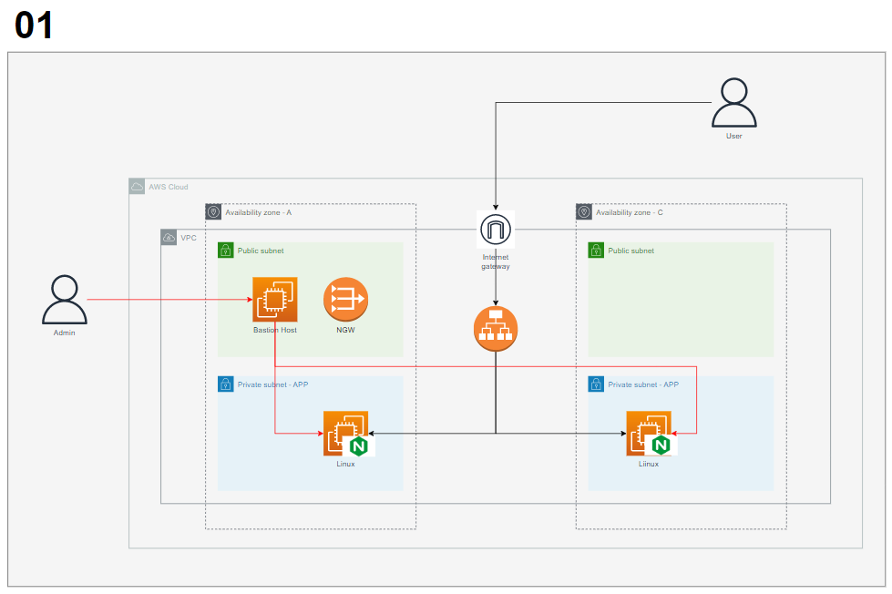

1.Architecture
=============


Resource
-----
* VPC, Subnet, Route Table
* IGW, NGW
* EC2
* ELB
* Security Group

2.Prerequisite
=============
### 1. AWS Credential
*Terraform apply*을 실행할 서버에 AWS Credential 생성.
```bash
$ aws configure
AWS Access Key ID [None]:
AWS Secret Access Key [None]:
Default region name [None]:
Default output format [None]:
```
### 2. SSH Key 생성
SSH 접속을 위한 Public/Private Key를 AWS 콘솔에서 생성.

### 3. terraform Install
[Terraform][URL] 공식 홈페이지에서 실행 파일 다운로드 또는 아래 명령어 통해 설치.

[URL]: https://developer.hashicorp.com/terraform/downloads

```bash
## Amazon Linux
sudo yum install -y yum-utils shadow-utils
sudo yum-config-manager --add-repo https://rpm.releases.hashicorp.com/AmazonLinux/hashicorp.repo
sudo yum -y install terraform

## Ubuntu
wget -O- https://apt.releases.hashicorp.com/gpg | sudo gpg --dearmor -o /usr/share/keyrings/hashicorp-archive-keyring.gpg
echo "deb [signed-by=/usr/share/keyrings/hashicorp-archive-keyring.gpg] https://apt.releases.hashicorp.com $(lsb_release -cs) main" | sudo tee /etc/apt/sources.list.d/hashicorp.list
sudo apt update && sudo apt install terraform
```
`terrafom version`으로 정상 설치 확인.

3.Usage
=============
### 1. Git Clone
```bash
$ git clone https://github.com/bespin-dn/terra-template.git
$ cd terra-template
```
### 2. Configuration
**terrform.tfvar** 내 설정 확인 및 알맞게 수정
```
context = {
    aws_credential_file = <Credential 파일 위치>
    aws_region = <리전>
    aws_profile = default

    project = "template-01"
}

vpc_cide = "10.10"
instance_type = <Web Instance Type>
key_name = <Key Pair 이름>
```

### 3. Run Command
```bash
$ terraform init
$ terraform plan
$ terraform apply