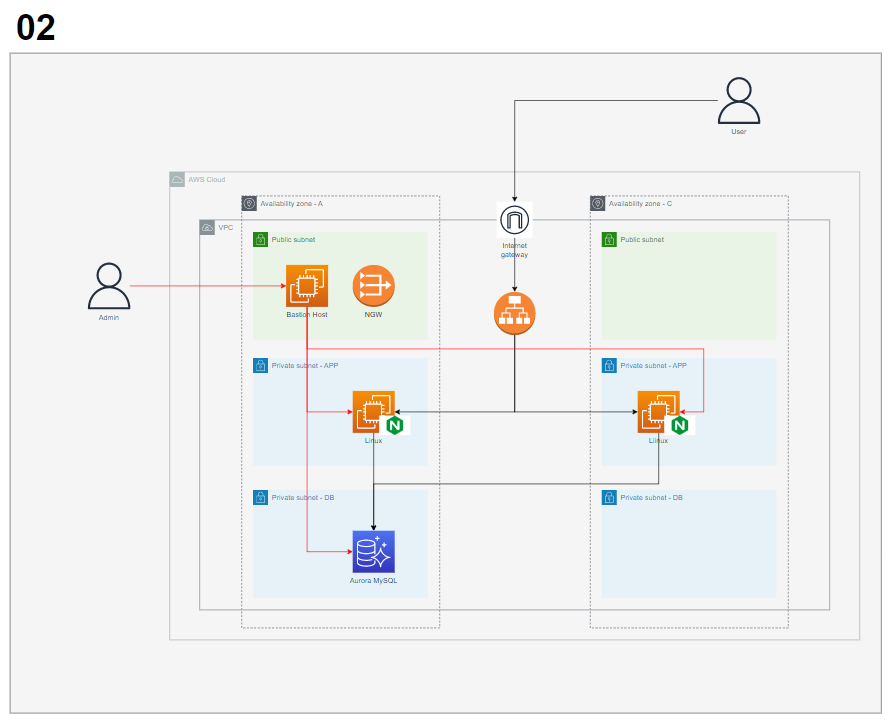

Architecture
=============


Resource
-----
* VPC, Subnet, Route Table
* IGW, NGW
* EC2
* ELB
* Security Group
* RDS

Usage
=============
### 1. Git Clone
```bash
$ cd terra-template/02
```
### 2. Configuration
**terrform.tfvar** 내 설정 확인 및 알맞게 수정
```bash
$ vi terraform.tfvar

context = {
    aws_credential_file = <Credential 파일 위치>
    aws_region = <리전>
    aws_profile = default

    project = "template-01"
}

vpc_cide = "10.10"
instance_type = <Web Instance Type>
rds_type = <RDS Instance Type>
key_name = <Key Pair 이름>
```

### 3. Run Command
```bash
$ terraform init
$ terraform plan
$ terraform apply